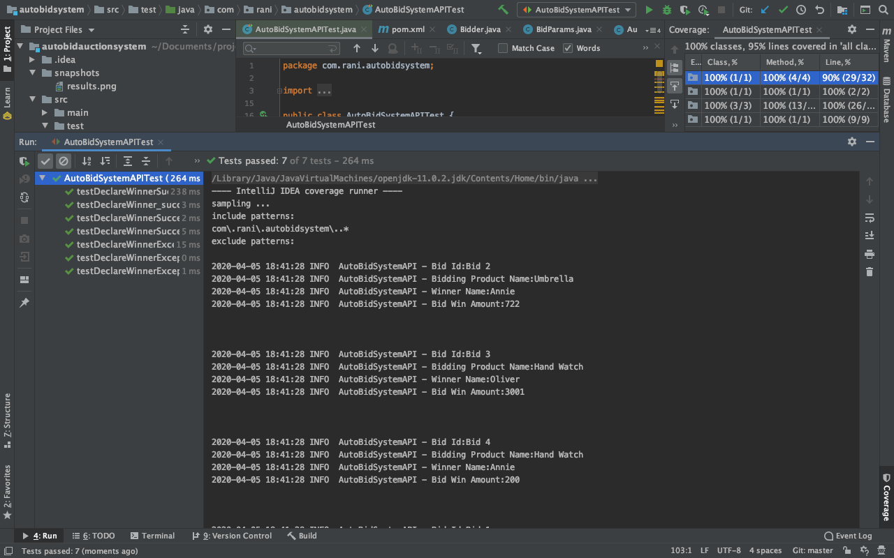

# Auto-bid  System

## Functionality covered

This application serves an auto-bid system functionality, giving bidders the ability to pre-authorize bids up to a maximum even when they aren't connected to the platform.
The objective of this  system is to create an API and algorithm for determining the winning bid after all bidders have entered their bid directions into the system.  
You can integrate this API in other project as well.

The API takes Bid object as parameter, which consist of list of Bidders 
and for Each bidder there will be following three parameters:
1.  __Starting bid__: The first and lowest bid the buyer is willing to offer for the item.

2.  __Max bid__: This maximum amount the bidder is willing to pay for the item.

3.  __Auto-increment amount__: A dollar amount that the computer algorithm will add to the bidder's current bid each time the bidder is in a losing position relative to the other bidders. 

* The algorithm never let the current bid exceed the Max bid. 

* The algorithm only allows increments of the exact auto-increment amount.

* For each bid, algorithm determines: __Who is the winning bidder__ and __What is the amount of the winning bid__

## Implemented validation to API.
    I have created API in fail-fast manner when data for one of the bidder is invalid then whole application will stop and ask you to enter correct data
    - BID object should not be null 
    - Bidders list should not be null
    - There should be atleast one bidder for the current bid
    - Auto-increment amount should not be negative
    - Max bid price should be greater than or equal to starting bid price

## Technology Stack

1.  Java
2.  Maven
5.  JUnit


## Steps to Run this Application on your machine

** 1. Install Java 1.8 or above **

** 2. Install latest apache maven on your machine
 All the steps are given here : http://maven.apache.org/

** 3. Get this code repo **

** 4. Import  Auto-bid System Project in Eclipse or Intellij **
    Required dependencies Junit and log4j I have already added in pom.xml
  
** 5. Build the app using maven **
    It will download the dependencies mentioned in pom.xml
    
** 6.Change the following property value  in log4j.properties file
    log4j.appender.file.File ="Path where you want to store your logs"   
    
***7. Now you can run AutoBidSystemAPITest class with coverage 
    or if you want to use this functionality in other applications you can call   

```
AutoBidSystemAPI.declareWinner() method by passing Bid class object.
```
So you need to create Bid class object(you can see what all parameters are required to create this object by checking the Bid constructor)

Alternatively, you can run the app by packaging it into JAR and importing it in your application


## Unit test Coverage
100% classes covered, 100% lines covered.



## Test Results
Given following input data and the last row Winner consist of the results which I got from the API

| Bidder           | Bid One: Shoes | Bid Two: Umbrella | Bid Three: Handwatch         |
|------------------|---------------------:|---------------------:|--------------------:|
| __Annie__        |                      |                      |                     |
| Starting Bid     | $50.00               | $700.00              | $2,500              |   
| Max Bid          | $80.00               | $725.00              | $3,000              |
| Increment amount | $3.00                | $2.00                | $500                |
| __Oliver__       |                      |                      |                     |
| Starting Bid     | $60.00               | $599.00              | $2,800              |
| Max Bid          | $82.00               | $725.00              | $3,100              |
| Increment amount | $2.00                | $15.00               | $201                |
| __Mary__         |                      |                      |                     |
| Starting Bid     | $55.00               | $625.00              | $2,501              |
| Max Bid          | $85.00               | $725.00              | $3,200              |
| Increment amount | $5.00                | $8.00                | $247                |
|                  |                      |                      |                     |       
|__Winner__        |                      |                      |                     |
|   Name           |    Mary              |  Annie               |    Oliver           |   
|Winning Bid Amount|     85               |     722              |     3001            | 

